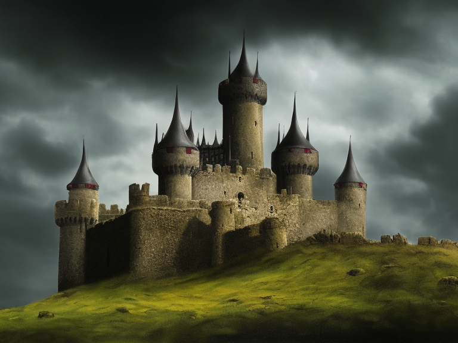

# GoCastle

## Introduction

This project is my journey to creating a graphical game while learning Golang

Every session, I'll add an entry in this file telling what I did and what I learned

## Prerequisites 

```bash
sudo apt-get install golang gcc libgl1-mesa-dev xorg-dev
```

## 2023-07-19

After a good night's sleep, I found out that one of the issue from yesterday was that I was changing the generated farmer/wolf coordinates AFTER putting it in the NPCList. 

```go
	// set wolf on map and draw it
	wolf := model.Wolf
	wolf.Avatar.PosX, wolf.Avatar.PosY = 22, 22
	NPCList.List = append(NPCList.List, wolf)
	drawSubject(mapContainer, wolf.Avatar)
```

Collisions with NPCs are still a bit broken. This was a stupid mistake in newTurnForNPCs function. I'm looping over npc with 
```go
	for _, npc := range NPCList.List {
```

**But npc is not a reference**, it's a whole new NPCStats object! I fixed it like this:

```go
	for index, _ := range NPCList.List {
		npc := &NPCList.List[index]
```

Now, player can't collide with NPCs anymore. But for some reason, NPCs can. :-( So much for an "easy refactor". But since they don't collide in anything else, I figured it was probably just a bug in the dontCollideWithPlayer() I wrote yesterday night. 

In fact, during refactor, I forgot to remove player's PosX/PosY variable from CharacterStats, which is now unified between Player and NPCs in Avatar struct.

```diff
-		if npc.PosX == futurePosX && npc.PosY == futurePosY {
+		if npc.Avatar.PosX == futurePosX && npc.Avatar.PosY == futurePosY {
```

Last but not list, I had trouble understanding that in Go, when you assign a struct variable to another variable, you are creating a "shallow copy" of the struct. Meaning that modifying one would affect the other. This prevented me to instanciate a new wolf.

So I created 2 functions to copy NPCs types I declared in model package

```go
func CreateNPC(npc NPCStats, x, y int) NPCStats {
	avatar := createAvatar(npc.Avatar, x, y)
	return NPCStats{
		Name:      npc.Name,
		Pronoun:   npc.Pronoun,
		Avatar:    avatar,
		MaxHP:     npc.MaxHP,
		CurrentHP: npc.CurrentHP,
		MaxMP:     npc.MaxMP,
		CurrentMP: npc.CurrentMP,
	}
}

func createAvatar(avatar Avatar, x, y int) Avatar {
	return Avatar{
		CanvasImage: canvas.NewImageFromFile(avatar.CanvasPath),
		PosX:        x,
		PosY:        y,
	}
}
```

Which allows me to create as much wolves as I want

```go
	// set two wolve at the edge of the map and draw them
	wolf := model.CreateNPC(model.Wolf, 22, 22)
	NPCList.List = append(NPCList.List, wolf)
	drawSubject(mapContainer, wolf.Avatar)
	wolf2 := model.CreateNPC(model.Wolf, 24, 21)
	NPCList.List = append(NPCList.List, wolf2)
	drawSubject(mapContainer, wolf2.Avatar)
```

I then ask ChatGPT to generate me more mobs (mage, ogre). They seemed satisfying enough. I reworked a bit the NPC addition on the map (created a function addNPCs that I'll rework later).

Some of my NPCs are hostiles (wolf, ogre) and other aren't (mage, farmer). I added this in the structure. This is preleminary to the first combat implementation! I don't want my hero killing innocent farmers T_T.

I then reworked the whole mapKeyListener function, and more specifically the pat where I check if path is walkable or not to add the attack logic.

The idea now is to:
* checkOutOfBounds() to prevent player from escaping the map
* getNPCAtPosition() to check if there is an NPC on our path
	* if hostile, deal some damage
	* if not hostile, we are blocked like before
	* if there are no NPC, checkTileIsWalkable()
		* if tile is walkable, move
		* if not, we are blocked

When NPCs will be able to return hits, checkWalkable() which did all that will cease to be useful.

I then created a function that take a npc (*model.NPCStats struct) and a damageDealt int as arguments: 
* If (npc.CurrentHP - damageDealt) is <= 0, print that NPC is dead
* If (npc.CurrentHP - damageDealt) > 0% and <= 20% of npc.MaxHP, and that CurrentHP > 20%, print that NPC looks barely alive
* If (npc.CurrentHP - damageDealt) > 20% and <= 50% of npc.MaxHP, and that CurrentHP > 50%, print that NPC looks seriously injured
* If (npc.CurrentHP - damageDealt) > 50% and <= 80% of npc.MaxHP, and that CurrentHP > 80%, print that NPC looks injured
* If (npc.CurrentHP - damageDealt) > 80% and < 100% of npc.MaxHP, and that CurrentHP = 100%, print that NPC looks barely injured

This way I can give additionnal information in the log entries on NPC remaining health.

The last thing I need to do is to remove the NPC from NPCList.List once he/she/it is dead, and remove the CanvasImage.

```go
				// let's attack!
				// TODO make this depending on strengh and gear
				playerDamage := 5
				addLogEntry(model.HandleNPCDamage(npc, playerDamage))
				npc.CurrentHP = npc.CurrentHP - playerDamage
				if npc.CurrentHP <= 0 {
					npc.Avatar.CanvasImage.Hidden = true
					removeNPCByIndex(npcId)
				}
```

I added more stats and modifications. Intelligence now change MPs, Strength and Dexterity improve base damage dealt on mobs.

## 2023-07-18

Today I started by doing to cleanup of the stats system. I moved the CharacterStats initialization in the model package instead of the newgame screen. I also switch all the stats from float64 (from the sliders) to int because all the characteristics will always be positive integers. 

I thought using uints first but I'm unconformable with the fact that some computations could lead to negative values. In some case it's not possible (there are no negative stats or negative levels) but in other it could (negative current health point, yeah, you're dead). I'll leave an issue for the future me.

All this is preliminary work to display live counters in the stats box of the game screen.

I then reworked the code from the newgame screen + game screen to clean some ugly things, move code in functions to improve readability, set up constants. 

No value is now set and then updated (like in newgame screen) and they are all dynamically displayed (specifically in updateStats() function but not only).

```go
func updateStats() {
	healthPointsValueLabel.Text = fmt.Sprintf("%d/%d", model.Player.CurrentHP, model.Player.MaxHP)
	healthPointsValueLabel.Refresh()

	manaPointsValueLabel.Text = fmt.Sprintf("%d/%d", model.Player.CurrentMP, model.Player.MaxMP)
	manaPointsValueLabel.Refresh()

	timeSpentValueLabel.Text = model.FormatDuration(model.TimeSinceBegin, "short")
	timeSpentValueLabel.Refresh()
}
```

```diff
-	pointsToSpendValue := widget.NewLabel("10")
+	pointsToSpendValue := widget.NewLabel(fmt.Sprintf("%d", model.Player.PointsToSpend))
```

Now, I can rework on NPCs a bit. I've added a new file called npc.go containing various structs that will be useful for next steps.

```go
type Avatar struct {
	AspectPath *canvas.Image
	PosX       int
	PosY       int
}

type NPCStats struct {
	Name      string
	Pronoun   string
	Avatar    Avatar
	MaxHP     int
	CurrentHP int
	MaxMP     int
	CurrentMP int
}
type NPCsOnCurrentMap struct {
	List []NPCStats
}

var (
	FarmerAvatar = Avatar{
		CanvasImage: canvas.NewImageFromFile("./static/farmer.png"),
	}
	Farmer = NPCStats{
		Name:      "farmer",
		Avatar:    FarmerAvatar,
		Pronoun:   "him",
		MaxHP:     10,
		CurrentHP: 10,
	}
)
```

On the map, I'll then remove the previous attempts to make NPCs and instanciate a list NPCsOnCurrentMap. The drawSubject() function is already nearly generic and so are movePlayer and moveNPC1 so only a little rework is required. 

That's what I thought but it turned out it was a bit of a pain xD. I managed to get something to compile but NPC movement and collision is totally broken now :trollface:.

## 2023-07-17

Now that I have PoCed the map, the character and the PNJs, it's time to take a look back at the main UI.

There are at least 2 elements missing in my "map" screen (that I'm probably going to rename) if I look at Castle's UI. At the bottom of the screen, there is a scrollable text area containing messages of what happened, and another text area containing various players stats like health points, magic points, etc.

To create these area, I had to change (again again) a bit the layout and switch to a container without layout for the various elements.

I then created NewVBox inside a NewVScroll in the package vars. 

```go
	logsArea               = container.NewVBox()
	logsScrollableTextArea = container.NewVScroll(logsArea)
```

This way I can add "log entries" from every functions of the package. I tried with mapKeyListener:

```go
		logsEntry := canvas.NewText(model.FormatDuration(model.TimeSinceBegin)+": you are blocked!", color.White)
		logsEntry.TextSize = 12
		logsArea.Add(logsEntry)
		logsScrollableTextArea.ScrollToBottom()
```

I also added a function FormatDuration() to display time spent by our character. Every actions will have specific time "costs". Walking costs 3s for each tile. Sleeping will cost a few hours, etc.

The last thing I started working on is the stats Box, in the right down corner which will display hp, mp, time spent and location (using map name)

```go
	statsTextArea := container.New(layout.NewGridLayout(2),
		healthPointsLabel, healthPointsValueLabel,
		manaPointsLabel, manaPointsValueLabel,
		timeSpentLabel, timeSpentValueLabel,
		locationLabel, locationValueLabel,
	)
```

I discovered that the theme depends on system being in light/dark mode. This is an issue because if I use text in black color on black theme you will not be able to read it.

There may be a more elegant solution (I haven't found it yet) but I found you can access the ThemeVariant from app settings and documentation (https://developer.fyne.io/api/v2.0/theme/) told me that `VariantDark fyne.ThemeVariant = 0` and `VariantLight fyne.ThemeVariant = 1`.

So I fixed it like that:

```go
	if goCastle.Settings().ThemeVariant() == 0 {
		// dark theme
		model.TextColor = color.White
	} else {
		// light theme
		model.TextColor = color.Black
	}
```

I also (re)discovered that almost all my screens support resizing by re-reading https://developer.fyne.io/explore/layouts

The main menu can be fixed easily with a Center Layout. The game screen may be tougher though since I heavily used fixed positions. So I removed the `mainWindow.SetFixedSize(true)` and worked on it.

```go
	buttons := container.New(layout.NewVBoxLayout(),
		newGameButton,
		loadGameButton,
		quitButton,
	)
	menu := container.New(layout.NewCenterLayout(), buttons)

	window.SetContent(container.New(layout.NewMaxLayout(),
		backgroundImage,
		menu))
```

I also think I can do something with the Border Layout for the map screen because documentation says
> All items in the container that are not positioned on a border will fill the remaining space.

Meaning I could but the bottom boxes (logs and stats) in the bottom border and the map will fill the rest. bottom boxes could also be handled as a border layout.

```go
	bottom := container.NewBorder(nil, nil, nil, statsTextArea, logsScrollableTextArea)
	content := container.NewBorder(nil, bottom, nil, nil, scrollableMapContainer)
```

And it works!!

## 2023-07-16

I replaced the first tile row+column that served to set a "size" to the scrollable container (because the container without layout has no size?) but black pixel lines (1x1000 and 1000x1). It works OK. Then, I cleaned the code a bit.

```go
	firstLine := container.NewHBox()
	horizontalBorder := canvas.NewImageFromFile("static/black_hline.png")
	horizontalBorder.FillMode = canvas.ImageFillOriginal
	horizontalBorder.Resize(fyne.NewSize(float32(mapMaxX-1)*32, 1))
	firstLine.Add(horizontalBorder)

	verticalBorder := canvas.NewImageFromFile("static/black_vline.png")
	verticalBorder.FillMode = canvas.ImageFillOriginal
	verticalBorder.Resize(fyne.NewSize(1, float32(mapMaxY-1)*32))
	secondLine := container.NewHBox(verticalBorder)
```

Finally, I made my first interactivity but listening to keystrokes and changing player position.

```go
[...]
	window.Canvas().SetOnTypedKey(mapKeyListener)
[...]


func mapKeyListener(event *fyne.KeyEvent) {
	if event.Name == fyne.KeyUp {
		playerPosY = playerPosY - 1
	} else if event.Name == fyne.KeyDown {
		playerPosY = playerPosY + 1
	} else if event.Name == fyne.KeyLeft {
		playerPosX = playerPosX - 1
	} else if event.Name == fyne.KeyRight {
		playerPosX = playerPosX + 1
	}

	drawPlayer()

}

func drawPlayer() {
	playerAvatar := canvas.NewImageFromFile("./static/warrior.png")
	playerAvatar.FillMode = canvas.ImageFillOriginal
	playerAvatar.Resize(fyne.NewSize(32, 32))
	playerAvatar.Move(fyne.NewPos(float32(playerPosX*32), float32(playerPosY*32)))
	mapContainer.Add(playerAvatar)
}

```

It doesn't work super well because you have to scroll to refresh the screen after a keystroke and previous position is not removed.

By rewriting a bit of code here and there (mostly, adding playerAvatar as a package var and only moving, not adding it to the mapContainer every time), I now have a working character that can be moved on the whole map and that can't get out of it :\).

The only remaining issue is the map horizontal + vertical borders that help me make the containerWithoutLayout scrollable aren't of the good size. I could leave them exactly the right size but that would prevent me from making maps from differents sizes.

So I rewrote this part (again!) to make a Hbox + VBox and adding just enough 32x1 and 1x32 pixel lines to fit the whole map (horizontalBorder & verticalBorder). Crude...

```go
	mapContainer = container.NewWithoutLayout()
	for i := 0; i < mapMaxY; i++ {
		firstLine.Add(horizontalBorder)
		currentLine := float32(i) * 32
		for j := 0; j < mapMaxX; j++ {
			if j == 0 {
				verticalBorder.Add(verticalLine)
			}
			tile := imageMatrix[i][j]
			tile.Resize(fyne.NewSize(32, 32))
			currentPos := fyne.NewPos(currentLine, float32(j)*32)
			tile.Move(currentPos)
			mapContainer.Add(tile)
		}
	}
```

After adding some new tiles, I needed to extract all map logic in another package. Even if I want to have maps that are generated randomly, some other maps are predetermined.

Tiles should then be stored in some way. To do this in a simple way, I've added a table called TilesTypes and map is a matrix with a number pointing on one of those tiles types.


```go
	TilesTypes = []string{
		"./static/grass.png",
		"./static/building_corner_left_up.png",
		"./static/building_corner_right_up.png",
		"./static/building_corner_right_down.png",
		"./static/building_corner_left_down.png",
		"./static/building_left.png",
		"./static/building_down.png",
		"./static/building_right.png",
		"./static/building_up.png",
		"./static/opaque.png",
	}
[...]
	Map1 = [][]int{
[...]
		{0, 0, 0, 0, 0, 0, 0, 0, 0, 0, 0, 0, 0, 0, 0, 0, 0, 0, 0, 0, 0, 0, 0, 0, 0, 0, 0, 0, 0, 0},
		{0, 0, 0, 0, 0, 0, 0, 0, 0, 0, 1, 5, 5, 5, 5, 4, 0, 0, 0, 0, 0, 0, 0, 0, 0, 0, 0, 0, 0, 0},
		{0, 0, 0, 0, 0, 0, 0, 0, 0, 0, 8, 9, 9, 9, 9, 6, 0, 0, 0, 0, 0, 0, 0, 0, 0, 0, 0, 0, 0, 0},
		{0, 0, 0, 0, 0, 0, 0, 0, 0, 0, 8, 9, 9, 9, 9, 6, 0, 0, 0, 0, 0, 0, 0, 0, 0, 0, 0, 0, 0, 0},
		{0, 0, 0, 0, 0, 0, 0, 0, 0, 0, 8, 9, 9, 9, 9, 6, 0, 0, 0, 0, 0, 0, 0, 0, 0, 0, 0, 0, 0, 0},
		{0, 0, 0, 0, 0, 0, 0, 0, 0, 0, 8, 9, 9, 9, 9, 6, 0, 0, 0, 0, 0, 0, 0, 0, 0, 0, 0, 0, 0, 0},
		{0, 0, 0, 0, 0, 0, 0, 0, 0, 0, 2, 7, 7, 7, 7, 3, 0, 0, 0, 0, 0, 0, 0, 0, 0, 0, 0, 0, 0, 0},
[...]
```

The result is pretty clean 😎.

There still is change to do to make it impossible for player to walk on some tiles (walls).

to do this I changed the TilesTypes from a string table to a Struct

```go
type TileInfo struct {
	Path       string
	IsWalkable bool
}
```

And I made some changes on mapKeyListener to check "walkability" before moving, in addition to checking we are not at the edge of the map. Probably will move the out of the map logic inside this function as well.

```go
func checkWalkable(futurePosX int, futurePosY int) {
	if maps.TilesTypes[currentMap[futurePosX][futurePosY]].IsWalkable {
		playerPosX = futurePosX
		playerPosY = futurePosY
	}
}
```

Now, you can't moved across walls :D

But now, I have a lot of individual tiles (and probably more coming) and they are all coming from the same source file. This is a bit dump, and I tried to find a way to extract the tiles I want by creating subimages of a bigger image.

That's how I managed to do it :

```go
type Coord struct {
	X, Y int
}

type TileInfo struct {
	Coordinates Coord
	IsWalkable  bool
}

var (
	TilesTypes = []TileInfo{
		{Coordinates: Coord{X: 0, Y: 64}, IsWalkable: true},     //0
		{Coordinates: Coord{X: 576, Y: 96}, IsWalkable: false},  //1
[...]

func extractTileFromTileset(coord Coord) (image.Image, error) {
	x, y := coord.X, coord.Y
	file, err := os.Open("static/RPG Nature Tileset.png")
	if err != nil {
		fmt.Println("Error opening image:", err)
		return nil, err
	}
	defer file.Close()

	bigImage, _, err := image.Decode(file)
	if err != nil {
		fmt.Println("Error decoding image:", err)
		return nil, err
	}

	width := 32
	height := 32

	partImage := image.NewRGBA(image.Rect(0, 0, width, height))
	draw.Draw(partImage, partImage.Bounds(), bigImage, image.Point{x, y}, draw.Src)

	return partImage, nil
}
```

Instead of pointing to a file, I pointed to coordonates on the main tileset file, and generate a subimage. Returned **partImage** is of image.Image type, which fyne supports if you use NewImageFromImage() instead of NewImageFromFile().

That's huge for future map creation process.

This also made me discover that I had mixed up all the axes, both in checkWalkable and mapContainer creation. Too many of i/j x/y h/v columns/rows...

Reworked mapKeyListener, checkWalkable and movePlayer to prepare for adding my first PNJ! checkWalkable only check if path is walkable and is generic (both player and PNJs). Doing somehing (only moving is implemented so far) triggers a new turn for PNJs (only moving for now as well). Farmer movement is random.

First implementation is very crude but it works well :\)

## 2023-07-15

Digging a bit on padding I've found that you can't change it on default Layouts. By default, all Layouts have padding between elements and you can only change it globally which is not recommended.

Howerever, you can create your own Layout which somehow could not inherit padding. I'm a bit at a loss here :-\( because no one really explain how to do this:

* https://github.com/fyne-io/fyne/issues/2719
* https://github.com/fyne-io/fyne/issues/1031
* https://stackoverflow.com/questions/60661694/padding-in-fyne-layout

I've tried the example given in documentation but it doesn't really help
* https://developer.fyne.io/extend/custom-layout

I have 3 workaround for this :
* try to remove padding globally (though I have yet to find how, its not documented either)
* use container.NewWithoutLayout like in mainmenu and set positions manually
* dig into custom layouts

Looking in source code (theme.go in fyne lib) I've found 

```golang
func (t *builtinTheme) Size(s fyne.ThemeSizeName) float32 {
	switch s {
[...]
	case SizeNameInnerPadding:
		return 8
	case SizeNamePadding:
		return 6
[...]
```

Then I realized why my UI is f* up since I created my own theme. I had overwritten the whole Size function which doesn't only change font size, but also borders and padding and so on 🤣 

Fixed it like this, UI looks a lot better :D

```go
func (t CustomTheme) Size(style fyne.ThemeSizeName) float32 {
	switch style {
	case theme.SizeNameInnerPadding:
		return 8
	case theme.SizeNamePadding:
		return 6
	case theme.SizeNameText:
		return 17
	default:
		return theme.DefaultTheme().Size(style)
	}
}
```

This doesn't fix my map issue though... So I tried setting SizeNameInnerPadding and SizeNamePadding to 0, but now UI looks horrible (obviously) AND I still have issues displaying the map (for some reason the tiles are very small, they don't take the whole 32px).

The reason was that I hadn't set the image size in map.go (using `Resize()`)

```
			image := canvas.NewImageFromFile("./static/grass.png")
			image.FillMode = canvas.ImageFillOriginal
			image.Resize(fyne.NewSize(32, 32))
			mapContainer.Add(image)
```

Setting only `SizeNamePadding` to 0 but not changing `SizeNameInnerPadding` produces OK results on UI while at the same time making the map work. It's even better if I bump `SizeNameInnerPadding` a bit.

Hurray!

Well, not so fast ;-\)

After a lot trial and error, I realised that creating a 50x50 Grid filled with containers without layout was both slow and also didn't work. For some reason there still is some padding involved when I try to display the character above the grass tile.

So I finally switched to 2nd workaround (new container without layout). It came with its own challenges. Building the map is easy, you just have to move elements by steps of 32 pixels. But there seem to be an issue when calculating the size of the container (which seems to be 0), making it unscrollable when inserted inside a scrollable container.

I worked around this for now by adding images of the length of the map. Crude but it works. I'll try to find a more elegant solution later.

Now, I have a working map with a character displayed on top of it.

Next step, movement and turns!!

## 2023-07-14

Reworked the characterAspect NewRadioGroup in 3 columns and added logic to support this

```go
	characterAspect1 = widget.NewRadioGroup([]string{"👩‍🦰", "👨‍🦰", "🧑‍🦰", "👱‍♀️", "👱‍♂️", "👱"}, func(selected string) {
		resetRadioGroups(characterAspect2, characterAspect3)
		fmt.Println("Character Aspect 1:", selected)
	})
[...]
func resetRadioGroups(groups ...*widget.RadioGroup) {
	for _, group := range groups {
		group.SetSelected("")
	}
}
```

Added more conditions on "Validate" to make sure character creation is finished

Reworked layout to fit well in the window. 

I extracted all the variables for the character in a new model package (with a simple struct, for now):

```go
package model

type CharacterStats struct {
	PointsToSpend     float64
	StrengthValue     float64
	ConstitutionValue float64
	IntelligenceValue float64
	DexterityValue    float64
	GenderValue       string
	AspectValue       string
}

var Player CharacterStats
```

"New Game" menu is ready :\)

I then tried to create a simple map. First things I tried was to create a grid and put it in a scrollable container

```
func ShowMapScreen(window fyne.Window) {
	mapContainer := container.New(layout.NewGridLayout(50))

	for i := 0; i < 50; i++ {
		for j := 0; j < 50; j++ {
			image := canvas.NewImageFromFile("./static/grass.png")
			image.FillMode = canvas.ImageFillOriginal
			mapContainer.Add(image)
		}
	}

	content := container.NewMax(container.NewScroll(mapContainer))

	window.SetContent(content)
}
```

This doesn't work very well as elements (columns + rows) have spaces between them, leaving a blank grid.

Note: The grass tile comes from [https://stealthix.itch.io/rpg-nature-tileset](https://stealthix.itch.io/rpg-nature-tileset)

## 2023-07-13

Added my first popup to tell player he/she forgot to allocate some point in character creation screen.

```go
		if PointsToSpend > 0 {
			content := widget.NewLabel("You still have available characteristics point to allocate!")
			dialog.ShowCustom("Points still available", "Close", content, window)
		}
```

```go
	characterGenderLabel := widget.NewLabel("Gender")
	genderRadioButton := widget.NewRadioGroup([]string{"Female", "Male", "Non-binary"}, func(selected string) {
	})

	characterAspect := widget.NewRadioGroup([]string{"👩‍🌾", "🧑‍🌾", "👨‍🌾", "🧙‍♀️", "🧙", "🧙‍♂️", "🦹‍♂️", "🥷", "🧝‍♀️", "🧝", "🧝‍♂️"}, func(selected string) {
	})
```

Added gender selection radio buttons + aspect selection button. Discovered that fyne 2.3 doesn't support emoji yet...

*[](https://github.com/fyne-io/fyne/issues/573)

## 2023-07-11

Still working on character creation menu. I'm looking into the issue I previously linked to fix entry for character name.

Solution found in [FyneConf 2021 Session 3 - Layouts youtube video](https://www.youtube.com/watch?v=LWn1403gY9E)

```go
	firstLine := container.New(layout.NewFormLayout(),
		characterNameLabel,
		characterNameEntry,
	)
```

Also interesting, I've found out about NewBorderLayout

I created a nice function to factorize slider creation and "points to allocate" logic

```
[...]
	strengthLabel := widget.NewLabel("Strength: 10")
	strengthRange := createSliderWithCallback("Strength", 5, 30,
		10, &StrengthValue, &PointsToSpend,
		strengthLabel, pointsToSpendValue)
[...]
func createSliderWithCallback(characteristic string, min float64, max float64,
	defaultValue float64, value *float64, pointsToSpend *float64,
	valueLabel, pointsToSpendLabel *widget.Label) *widget.Slider {
	slider := widget.NewSlider(min, max)
	slider.Value = defaultValue
	slider.OnChanged = func(v float64) {
		if (*pointsToSpend - (v - *value)) >= 0 {
			*pointsToSpend = *pointsToSpend - (v - *value)
			*value = v
		} else {
			slider.Value = *value
			slider.Refresh()
		}
		valueLabel.SetText(fmt.Sprintf("%s: %.0f", characteristic, *value))
		pointsToSpendLabel.SetText(fmt.Sprintf("%.0f", *pointsToSpend))
		valueLabel.Refresh()
	}
	return slider
}
```

## 2023-07-09

I've added a fixed size for the windows

```go
    mainWindow.SetFixedSize(true)
    mainWindow.Resize(fyne.NewSize(800, 600))
```

And a Makefile to save some time

I can now rebuild and launch with 

```bash
make buildrun
```

Don't use the VBox layout of else the buttons will take the whole width

```go
menu := container.NewWithoutLayout
```

Add size and positions for the buttons

```go
	defaultButtonSize := fyne.NewSize(100, 40)
	newGameButton.Resize(defaultButtonSize)
	loadGameButton.Resize(defaultButtonSize)
	quitButton.Resize(defaultButtonSize)

	newGameButton.Move(fyne.NewPos(350, 220))
	loadGameButton.Move(fyne.NewPos(350, 275))
	quitButton.Move(fyne.NewPos(350, 330))
```

Generate an castle image for the first screen with stable diffusion and add a background image



Split code (create a special package to separate code for each screen) and add some new screens (new game and load game, empty for now)

```
screens/
	loadgame.go
	mainmenu.go
	newgame.go
```

Add a gitignore and move binary to bin/ directory

Added a lot of widgets in the new game screen, some logic is missing (number of points to allocate to personalize player)

```go
	firstLine := container.NewHBox(
		characterNameLabel,
		characterNameEntry,
	)

	slidersLine := container.New(layout.NewGridLayout(5),
		pointsToSpendLabel, strengthLabel, constitutionLabel, intelligenceLabel, dexterityLabel,
		pointsToSpendValue, strengthRange, constitutionRange, intelligenceRange, dexterityRange)

	lastLine := container.NewHBox(
		backButton,
		validateButton,
	)
```

Also, "entry" with Character name is broken due to NewHBox. See https://github.com/fyne-io/fyne/issues/3337

## 2023-07-07

I'm going to use [fyne](https://developer.fyne.io/started/) toolkit which is a simple tool to create graphical user interfaces in Golang. It seems to be simple enough, I hope it's not too small.

**Installing prerequisites**

```bash
sudo apt-get install golang gcc libgl1-mesa-dev xorg-dev
```

And then reboot

Creating a directory and bootstraping golang project

```bash
mkdir gocastle
cd gocastle
```

**Bootstrap app**

Creating a new go module

```bash
go mod init gocastle
go: creating new go.mod: module gocastle
go: to add module requirements and sums:
        go mod tidy
zwindler@normandy:/windows/Users/zwindler/sources/gocastle$ 
```

Creating a main.go file

```golang
package main

import (
	"fyne.io/fyne/v2/app"
	"fyne.io/fyne/v2/container"
	"fyne.io/fyne/v2/widget"
)

func main() {
	myApp := app.New()
	mainWindow := myApp.NewWindow("GoCastle")

	newGameButton := widget.NewButton("New Game", func() {
	})
	loadGameButton := widget.NewButton("Load Game", func() {
	})
	quitButton := widget.NewButton("Quit", func() {
		myApp.Quit()
	})

	menu := container.NewVBox(
		newGameButton,
		loadGameButton,
		quitButton,
	)

	mainWindow.SetContent(menu)
	mainWindow.ShowAndRun()
}
```

Init the project, download fyne, build and run it

```bash
go mod init gocastle
go mod tidy
go build
./gocastle
```

It will crash with this error if you haven't rebooted (cf https://github.com/ScenicFramework/scenic_driver_glfw/issues/6#issuecomment-419741773)

```
GLX: Failed to create context: BadValue (integer parameter out of range for operation)
```
